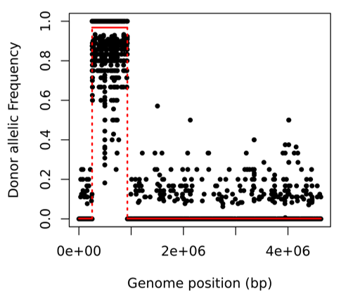
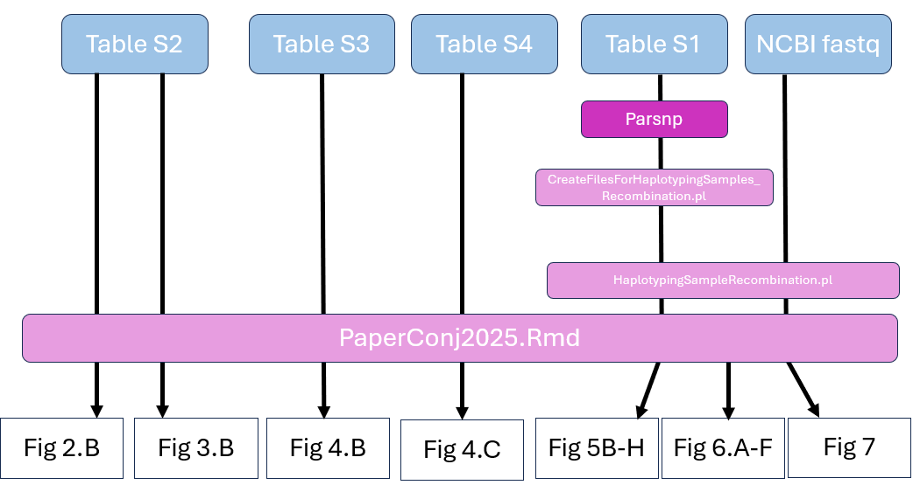
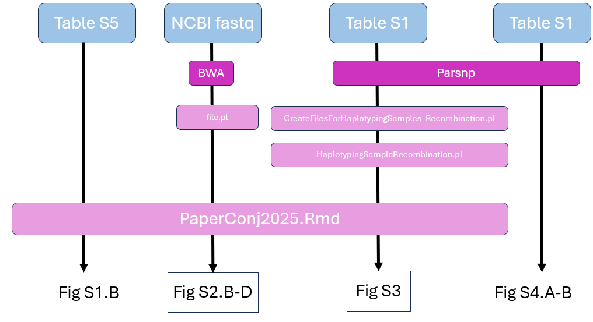

# High-throughput conjugation for trait mapping

This repository contains the code and resources used in the research paper:

**Title** : "High-Throughput Conjugation Reveals Strain Specific Recombination Patterns Enabling Precise Trait Mapping in *Escherichia coli*"

**Published in** : October 2025, PLOS Genetics

**Authors** : Thibault Corneloup , Juliette Bellengier et *al*. [link to the paper]  

___
We provide here the codes and data to reproduce the key results and figures of the paper.    
Data can be access on: 
[https://www.ncbi.nlm.nih.gov/bioproject/PRJNA1219123]
___

## **Repository Structure**  
📂 HGT_2025/  
├── 📂 codes/  
├── 📂 data/  
├── 📂 Figures/  
├── 📄 README.md  
└── 🖼️ Figure.png  
___

## **Paper summary**  
Summary of how the Figures were created with the data and tools described below.
### **Main Figures**  

### **Supplementary Figures**  

For further questions, feel free to contact: [juliette.bellengier@pasteur.fr]

