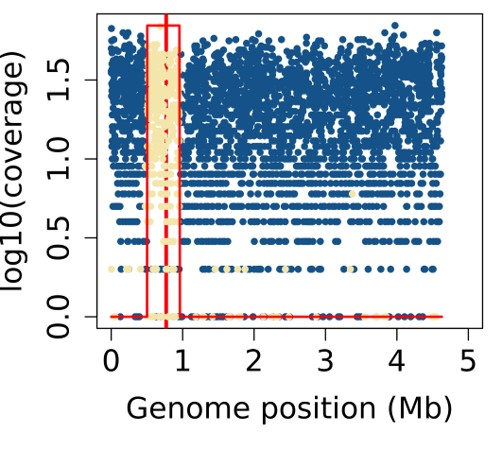

## High-throughput conjugation for trait mapping

This repository contains the code and resources used in the research paper:

**Title** : "High-Throughput Conjugation Reveals Strain Specific Recombination Patterns Enabling Precise Trait Mapping in *Escherichia coli*"

**Published in** : [XXXX]

**Authors** : Thibault Corneloup , Juliette Bellengier et *al*. [link to the paper]  

___

### **Repository Structure**  
📂 HGT_2025/  
├── 📂 codes/  
├── 📂 data/  
├── 📂 results/  
├── 📄 README.md  
└── 🖼️ rec25.png  
___

### **Paper summary**  
We provide here the codes and data to reproduce the key results and figures of the paper.
Data can be access on: 

For further questions, feel free to contact: [juliette.bellengier@pasteur.fr]

